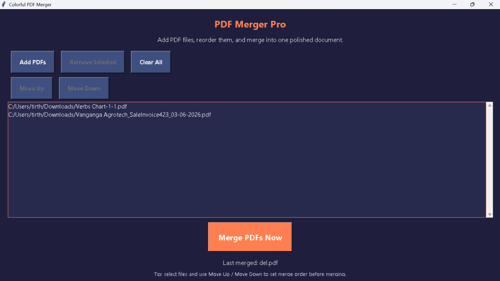
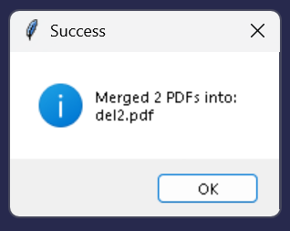

# Merge_pdf
A desktop PDF merger application built with Python, Tkinter, and PyPDF that allows users to add, reorder, and merge multiple PDF files through a clean graphical interface.

# PDF Merger Pro

A colorful desktop application built with Python and Tkinter that allows users to merge multiple PDF files into a single PDF.

## Features

- Add multiple PDF files
- Remove selected files
- Reorder PDFs using Move Up and Move Down
- Merge PDFs into one file
- Clean and colorful UI
- Scrollable PDF list

## Technologies Used

- Python
- Tkinter
- pypdf

## Installation

pip install pypdf

## Run

python pdf_merger.py

##Screenshot
## Screenshot

